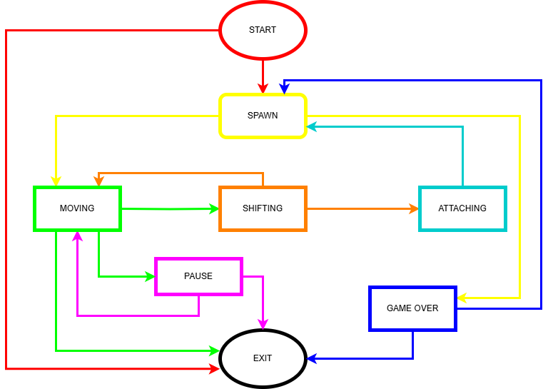

# BrickGame Тетрис

В данном проекте реализована игра «Тетрис» на языке программирования С с использованием структурного подхода.

### BrickGame

BrickGame — популярная портативная консоль 90-ых годов с несколькими ~~тысячами~~ встроенными играми, разработана она была в Китае. Изначально эта игра была копией, разработанной в СССР и выпущенной Nintendo в рамках платформы GameBoy игры «Тетрис», но включала в себя также и множество других игр, которые добавлялись с течением времени. Консоль имела небольшой экранчик с игровым полем размера 10 х 20, представляющим из себя матрицу «пикселей». Справа от поля находилось табло с цифровой индикацией состояния текущей игры, рекордами и прочей дополнительной информацией. Самыми распространенными играми на BrickGame были: тетрис, танки, гонки, фроггер и змейка.

### Тетрис

«Тетрис», наверное, одна из самых популярных игр для консоли Brickgame. Нередко и саму консоль называют тетрисом. Цель игры — в наборе очков за построение линий из генерируемых игрой блоков. Очередной блок, сгенерированный игрой, начинает опускаться вниз по игровому полю, пока не достигнет нижней границы или не столкнется с другим блоком. Пользователь может поворачивать фигуры и перемещать их по горизонтали, стараясь составлять ряды. После заполнения ряд уничтожается, игрок получает очки, а блоки, находящиеся выше заполненного ряда, опускаются вниз. Игра заканчивается, когда очередная фигура останавливается в самом верхнем ряду.

Для формализации логики данной игры можно представить следующий вариант конечного автомата:

Данный КА состоит из следующих состояний:

- Старт — состояние, в котором игра ждет, пока игрок нажмет кнопку готовности к игре.
- Спавн — состояние, в которое переходит игра при создании очередного блока и выбора следующего блока для спавна.
- Перемещение — основное игровое состояние с обработкой ввода от пользователя: поворот блоков/перемещение блоков по горизонтали.
- Сдвиг — состояние, в которое переходит игра после истечения таймера. В нем текущий блок перемещается вниз на один уровень.
- Соединение — состояние, в которое переходит игра после «соприкосновения» текущего блока с уже упавшими или с землей. Если образуются заполненные линии, то она уничтожается, и остальные блоки смещаются вниз. Если блок останавливается в самом верхнем ряду, то игра переходит в состояние «игра окончена».
- Игра окончена — игра окончена.

### Информация

- Программа разработана на языке С стандарта C11 с использованием компилятора gcc.
- Программа состоит из двух частей: библиотеки, реализующей логику игры тетрис, и терминального интерфейса с использованием библиотеки `ncurses`.
- Для формализации логики игры должен быть использован конечный автомат.
- Библиотека имеет функцию, принимающую на вход ввод пользователя, и функцию, выдающую матрицу, которая описывает текущее состояние игрового поля при каждом ее изменении.
- Код библиотеки программы находится в папке `src/brick_game/tetris`.
- Код с интерфейсом программы находится в папке `src/gui/cli`.
- Сборка программы настроена с помощью Makefile со стандартным набором целей для GNU-программ: all, install, uninstall, clean, dvi, dist, test, gcov_report. Установка ведется в каталог build.
- Программа разработана в соответствии с принципами структурного программирования.
- Код программы соответствует Google Style.
- Обеспечено покрытие библиотеки unit-тестами с помощью библиотеки `check` и покрытие тестами составляет не меньше 80 процентов.
- В игре присутствовуют следующие механики:
  - Вращение фигур;
  - Перемещение фигуры по горизонтали;
  - Ускорение падения фигуры (при нажатии кнопки фигура перемещается до конца вниз);
  - Показ следующей фигуры;
  - Уничтожение заполненных линий;
  - Завершение игры при достижении верхней границы игрового поля;
  - В игре должны присутствовать все виды фигур, показанные на картинке ниже.
- Для управления реализована поддержка всех кнопок, предусмотренных на физической консоли:
  - Начало игры,
  - Пауза,
  - Завершение игры,
  - Стрелка влево — движение фигуры влево,
  - Стрелка вправо — движение фигуры вправо,
  - Стрелка вниз — падение фигуры,
  - Стрелка вверх — не используется в данной игре,
  - Действие (вращение фигуры).
- Игровое поле соответствует размерам игрового поля консоли: десять «пикселей» в ширину и двадцать «пикселей» в высоту.
- Фигура после достижения нижней границы поля или соприкосновения с другой фигурой останавливается. Вслед за этим происходит генерация следующей фигуры, показанной на превью.
- Пользовательский интерфейс поддерживает отрисовку игрового поля и дополнительной информации.

Используемые фигуры:

### Подсчет очков и рекорд в игре. Механика уровней

В игре реализованы следующие механики:

- подсчет очков;
- хранение максимального количества очков.

Данная информация передается и выводится пользовательским интерфейсом в боковой панели. Максимальное количество очков хранится в файле и сохраняется между запусками программы.

Максимальное количество очков изменяется во время игры, если пользователь во время игры превышает текущий показатель максимального количества набранных очков.

Начисление очков происходит следующим образом:

- 1 линия — 100 очков;
- 2 линии — 300 очков;
- 3 линии — 700 очков;
- 4 линии — 1500 очков.

Каждый раз, когда игрок набирает 600 очков, уровень увеличивается на 1. Повышение уровня увеличивает скорость движения фигур. Максимальное количество уровней — 10.

### Сборка

- make install - Сборка и установка игры в папку build
- make unistall - Удаление программы и очистка содержимого папки build
- make play - Запуск игры
- make test - Покрытие unit-тестами c помощью библиотеки Check
- make gcov_report - Формирование отчёта gcov в виде html страницы
- make dvi - Компиляция doxygen-файла с документацией
- make dist - Архивирование проекта
- make clang - Проверка кода с помощью clang-format
- make cppcheck - Проверка кода с помощью cpp-check
- make leaks - Проверка тестов на утечки памяти
- make clean - Удаление ненужных файлов
